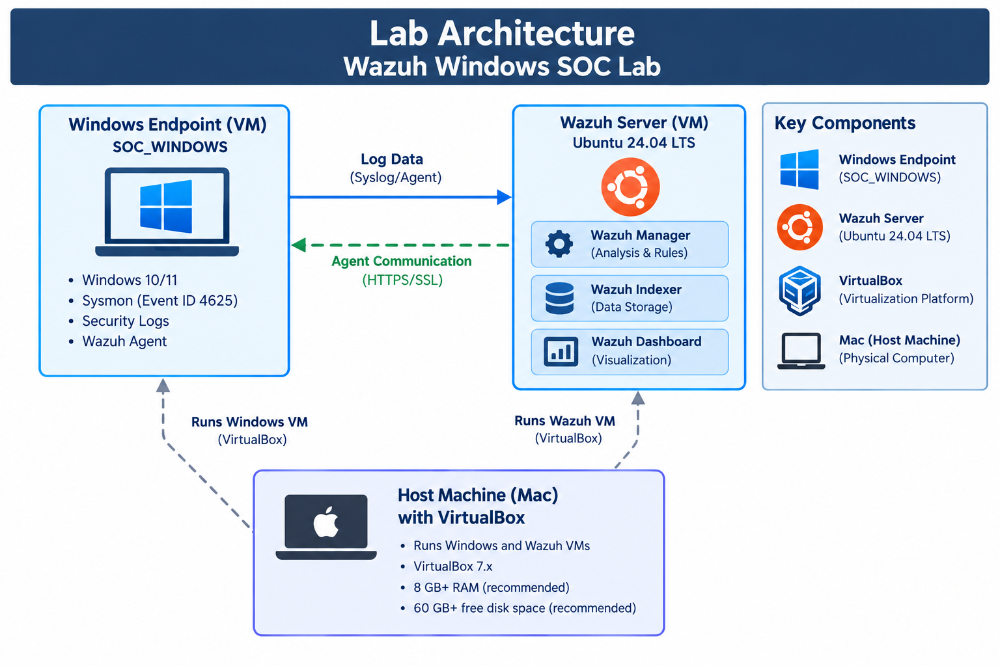
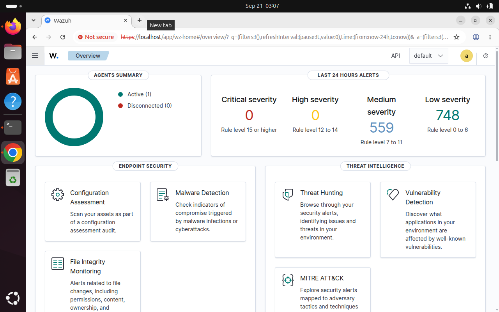
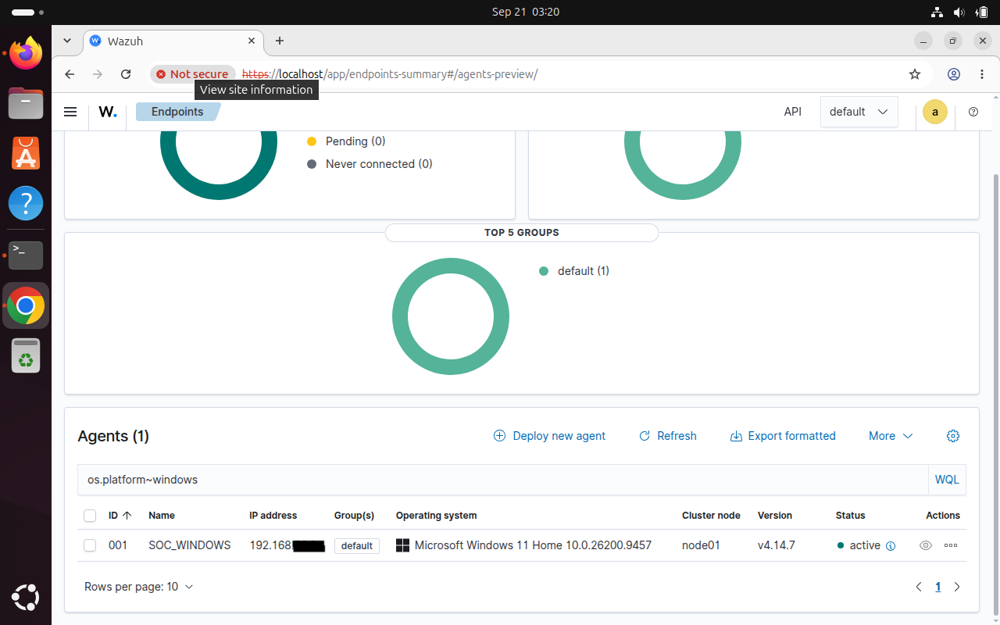
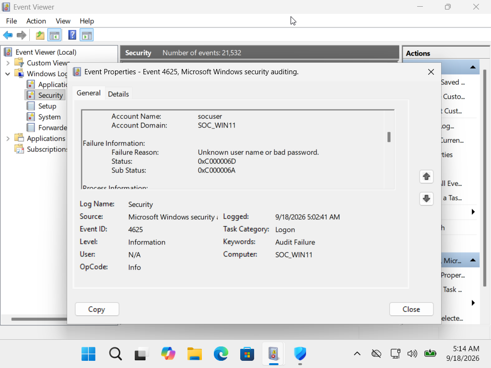
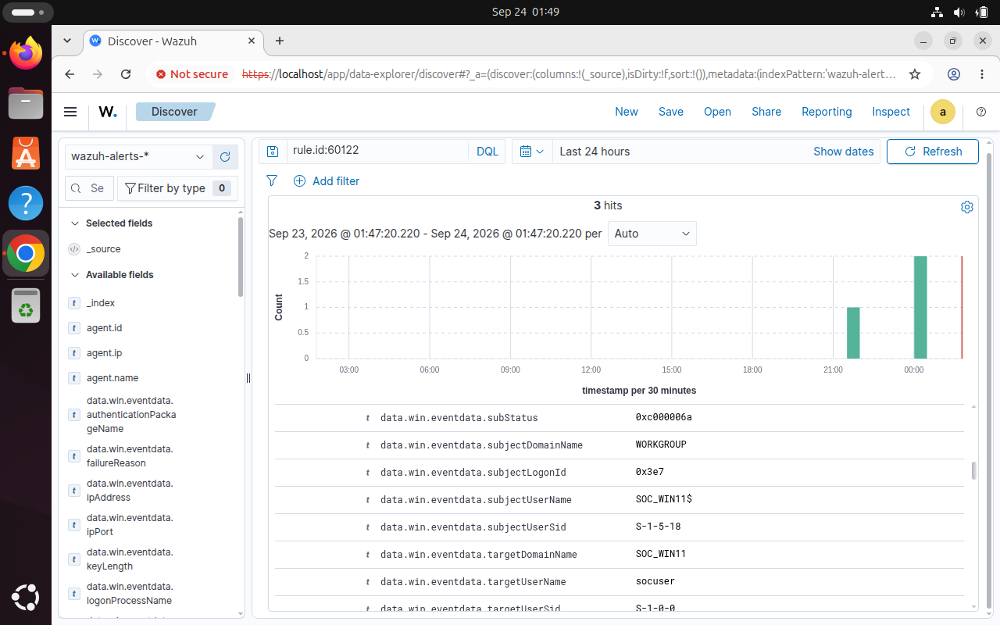
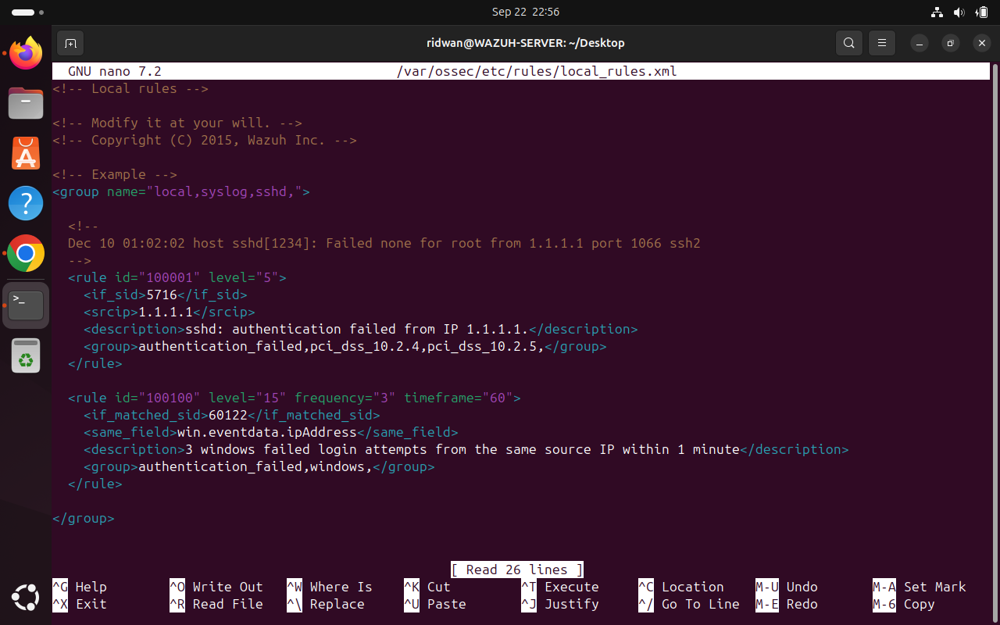

# Wazuh-Windows-SOC-Lab

Windows SOC monitoring and detection lab using Wazuh, Windows Event Logs,  and custom security detection rules.

### Project Overview

This project is a Windows-based Security Operations Center (SOC) monitoring lab built using Wazuh, Ubuntu, and Windows 11.

The lab demonstrates how security telemetry can be collected from a Windows endpoint, analyzed by Wazuh, and used to identify repeated failed authentication activity.

The project includes endpoint monitoring, Windows security event analysis, Wazuh agent deployment, custom detection rule development, event correlation, and investigation of a simulated authentication attack pattern.

The goal of the lab is to demonstrate practical SOC monitoring and detection engineering skills in a controlled environment.

### Lab Architecture

The lab consists of an Ubuntu-based Wazuh server monitoring a Windows 11 endpoint through the Wazuh agent.

### Lab Components

* **Wazuh Server:** Ubuntu 24.04 LTS running Wazuh 4.14.7
* **Monitored Endpoint:** Windows 11 VM (`SOC_WINDOWS`)
* **Wazuh Agent:** Installed on the Windows endpoint
* **Security Telemetry:** Windows Security Event ID 4625
* **Detection:** Wazuh Rule 60122 and custom Rule 100100
* **Correlation:** Three failed authentication events within five minutes from the same `win.eventdata.ipAddress` value

### Detection Overview

This lab was designed to simulate a Security Operations Center (SOC) monitoring environment using Wazuh to collect and analyze security telemetry from a Windows 11 endpoint.

The detection scenario focused on identifying repeated Windows failed authentication attempts that could indicate suspicious brute-force activity.

A custom Wazuh correlation rule was created to detect:

- 3 failed login attempts
- Within 1 minute
- From the same source IP field
- Against the Windows endpoint.

The underlying Windows authentication failures generated Event ID 4625, which was initially detected by Wazuh Rule 60122. A custom Rule 100100 was then configured to correlate the repeated events and generate a higher-priority alert for investigation.

The activity was intentionally generated within the lab environment to validate the detection logic and does not represent a confirmed real-world attack.

### Project Objectives

* Deploy and configure a Wazuh security monitoring environment on Ubuntu.
* Connect a Windows 11 endpoint to Wazuh using the Wazuh agent.
* Collect and analyze Windows security telemetry.
* Validate Windows failed authentication events using Event ID 4625.
* Develop a custom Wazuh correlation rule for repeated failed login attempts.
* Investigate and document a simulated suspicious authentication pattern.
* Demonstrate the detection and investigation workflow used in a SOC environment.
  

### Tools & Technologies

* Wazuh 4.14.7 — Security monitoring, log analysis, and detection
* Ubuntu 24.04 LTS — Wazuh server operating system
* Windows 11 — Monitored endpoint
* Windows Event Viewer — Security event generation and validation
* Sysmon — Windows system activity monitoring
* VirtualBox — Virtual machine environment
* Wazuh Agent — Endpoint telemetry collection
* Custom Wazuh Rules — Detection and event correlation

### Windows Endpoint Configuration

The Windows 11 virtual machine was configured as the monitored endpoint in the SOC lab.

The following components were configured:

* Windows 11 virtual machine running in VirtualBox.
* Wazuh Agent installed and connected to the Wazuh server.
* Windows Security Event Logging enabled.
* Sysmon installed to provide additional endpoint activity telemetry.
* A dedicated lab user account (socuser) used to generate authentication events.

Windows Security Event ID 4625 was used to validate failed authentication activity. Multiple failed login attempts were intentionally generated within the lab to test the Wazuh detection logic.

### Wazuh Server Configuration

The Wazuh server was deployed on an Ubuntu 24.04 LTS virtual machine and configured to provide centralized security monitoring for the Windows endpoint.

The Wazuh environment consisted of:

* Wazuh Manager — Processes and analyzes security events.
* Wazuh Indexer — Stores and indexes collected security data.
* Wazuh Dashboard — Provides the interface for monitoring and investigating alerts.
* Wazuh Agent — Collects security telemetry from the Windows endpoint.

The Windows endpoint was successfully enrolled with the Wazuh server and appeared as an active agent in the Wazuh Dashboard.

Security events generated on the Windows endpoint were then forwarded to Wazuh for analysis and detection.

### Detection Engineering

The detection logic was developed to identify repeated Windows authentication failures originating from the same source.

Windows Event ID 4625 was used as the underlying authentication failure event. Wazuh Rule 60122 initially identified the failed authentication events.

A custom Wazuh rule, Rule 100100, was created to correlate multiple occurrences of the underlying event.

The custom rule was configured with the following conditions:

Frequency: 3 events
Timeframe: 1 minute
Correlation field: win.eventdata.ipAddress
Base rule: 60122
Custom rule: 100100

This configuration allows Wazuh to identify three failed authentication events within one minutes that contain the same source IP field value and generate a correlated alert for investigation.

### Detection Scenario

A simulated authentication attack pattern was generated against the Windows 11 endpoint to validate the custom detection rule.

Three unsuccessful login attempts were intentionally generated within 1 minute period using the lab environment.

The Windows endpoint recorded each failed authentication attempt as Event ID 4625. Wazuh processed the events through the existing authentication failure detection logic.

After the required threshold was reached, Rule 100100 correlated the events based on the win.eventdata.ipAddress field and generated the corresponding alert.

The detection was successfully validated in the Wazuh Dashboard.

### Investigation Summary

The generated alert was investigated in the Wazuh Dashboard to validate the underlying authentication events and detection logic.

The investigation confirmed:

* Windows Event ID: 4625
* Base Wazuh Rule: 60122
* Custom Wazuh Rule: 100100
* Failed authentication attempts: 3
* Detection timeframe: 1 minute
* Correlation field: win.eventdata.ipAddress
* Target account: socuser
* Logon Type: 2 (Interactive)
* Activity: Intentionally generated within the lab environment

The three failed authentication events were successfully correlated by the custom rule, confirming that the detection logic operated as designed.

No conclusion of malicious activity was made because the events were intentionally generated as part of the controlled lab exercise.

Results

The Wazuh monitoring environment successfully collected security telemetry from the Windows 11 endpoint and processed the generated authentication events.

The custom detection logic successfully:

* Identified Windows failed authentication events using Event ID 4625.
* Correlated three failed authentication events within the configured timeframe.
* Matched the events using the win.eventdata.ipAddress field.
* Generated a custom alert using Wazuh Rule 100100.
* Provided the resulting alert for investigation through the Wazuh Dashboard.

This lab demonstrated the workflow of collecting endpoint telemetry, developing a detection rule, validating the detection, and investigating the resulting security alert in a controlled SOC environment.

Screenshots

The following screenshots provide visual evidence of the lab configuration, monitoring environment, detection logic, and investigation results.

</> Markdown

### Wazuh Dashboard

Shows the Wazuh monitoring environment and active Windows endpoint.

### Active Windows Agent

Shows the SOC_WINDOWS endpoint successfully connected to the Wazuh server.

### Windows Event ID 4625

Shows the failed authentication event generated in the Windows Security event log on the Windows endpoint.

Wazuh Rule 60122

Shows the underlying Wazuh detection for the Windows failed authentication event.

Custom Rule 100100

Shows the custom correlation rule successfully generating an alert after the configured threshold was reached.

Alert Investigation

Shows the resulting alert details and event information used to validate the detection.
